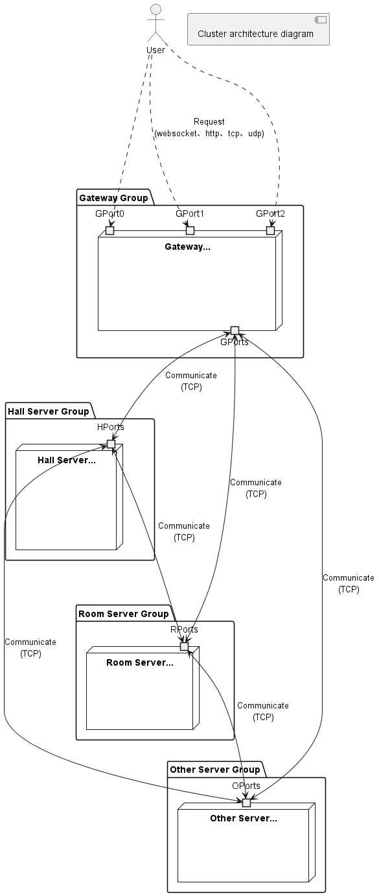
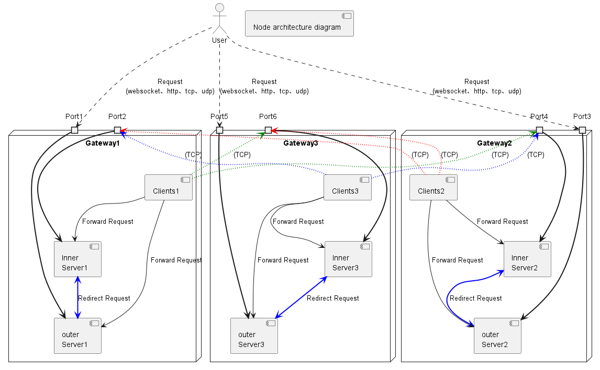
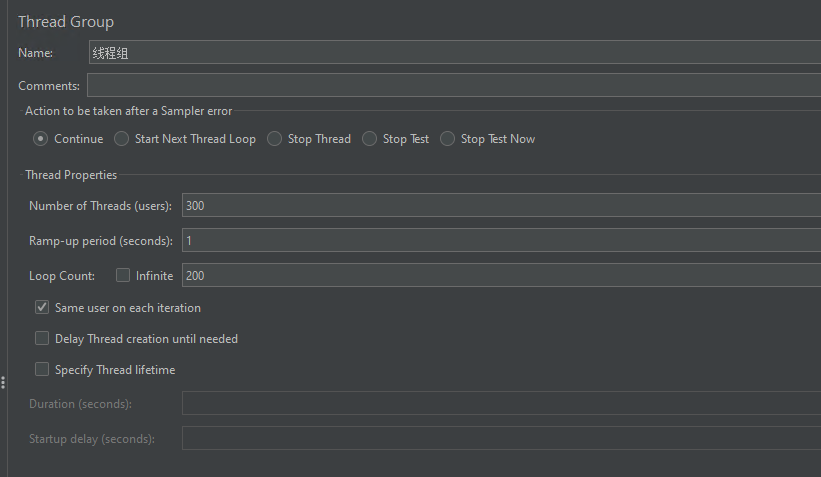
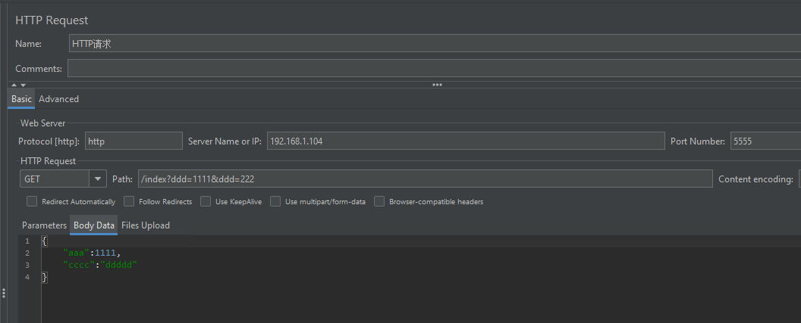
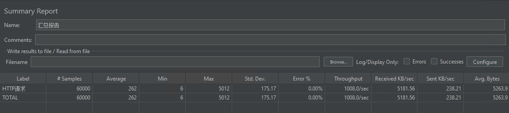
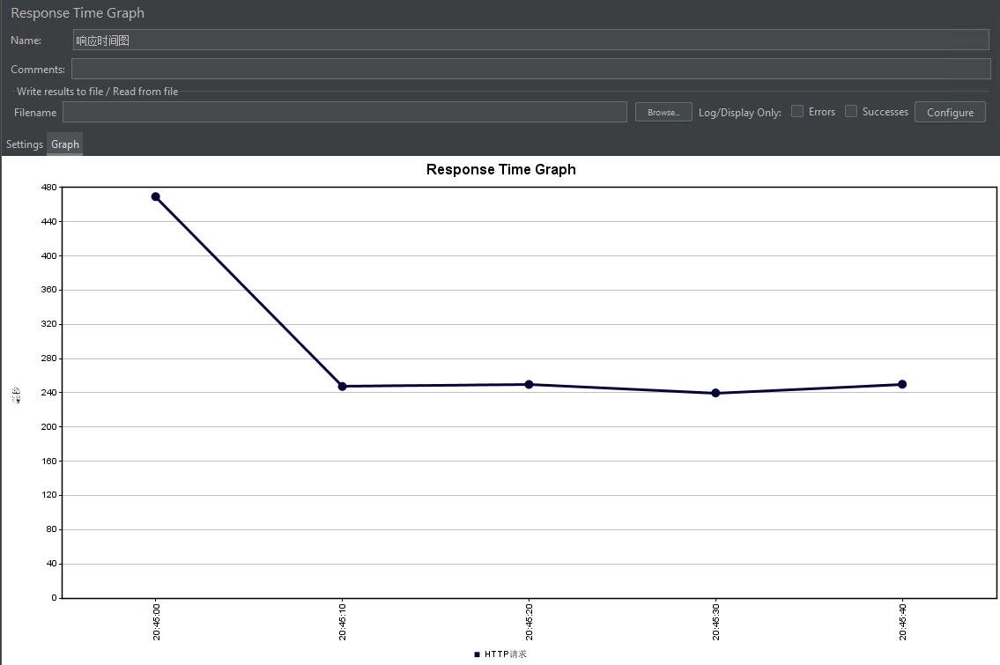

<h1 align="center" style="margin: 30px 0 30px; font-weight: bold;">Network-Server</h1>
<h3 align="center">Simplifying the construction of network cluster services</h3>

### Introduction

> Based on Netty network framework and Springboot framework.
>
> The target is let easy to build a network cluster server. Minimize the use of third-party dependency libraries as much as possible.

### Architecture diagram


---


### Existing features

1. Supports multiple network protocols, including TCP, UDP, HTTP, and WEBSOCKET; Multiple protocols can be configured on
   the same port.

[comment]: <> (1. 多网络协议支持，支持TCP、UDP、HTTP、WEBSOCKET协议;同端口支持多种协议（可配置）)

2. Supports multi-node clusters and dynamic node joining and exiting

[comment]: <> (2. 支持多节点集群，支持节点动态加入、退出)

3. Supports message forwarding between internal and external networks


4. Supports distributed transactions `server-message-queue` module

### Modules introduction

1. `server-framework`: The `core module` of the framework, which provides the basic configuration of the framework, and
   the configuration of the network protocol, the message forwarding, and the message processing.


2. `server-database`: The `database` module of the framework, use `Mybatis` and `MySQL` to implement the database
   operation. If you need to use a MySQL database, you can use it.`that is optional`.


3. `server-cache`: The `cache` module of the framework, use `Redisson` to implement the `Redis` cache operation, and
   use `Caffeine` to implement the local cache operation. If you need to use a caching module, you can use
   it.`that is optional`.


4. `server-permission`: The `permission` module of the framework, Use `Spring AOP` and annotations to control interface
   permissions. The HTTP protocol uses the request header entrainment JWT method, the UDP protocol uses the JWT string
   as the first field, and the `permissions` field in the `UserSession` is used for TCP and WebSocket. If you need
   to use a `permission` module, you can use it.`that is optional`.


5. `server-access-control`: The `access control` module of the framework, Use `Spring AOP` and annotations
   and `Guava library` to limit the rate of the interface. You can limit the rate of interfaces uniformly or based on
   user granularity, and configure IP blacklists and whitelists. If you need to use a `access control` module, you can
   use it.`that is optional`.


6. `server-message-queue`: The `message queue` module of the framework, Use the `server-framework` module to develop a
   message queue module that supports message subscription and message push. If you need to use a `message queue`
   module, you can use it.`that is optional`.


7. `gateway-server`、`hall-server`、`room-server`: These are three `sample nodes` of the cluster, and you can refer to
   their configurations to get your own cluster

### How to use

1. You must had installed JDK 1.8+ and Maven 3.x
2. Switch to the project directory and run `mvn clean install`
3. Add the `server-framework` dependency in your project

```xml

<dependency>
    <groupId>com.hbsoo</groupId>
    <artifactId>server-framework</artifactId>
    <version>1.0.0</version>
</dependency>
```

4. Add the `server-framework` Configuration to your Springboot project `application.yml` file.

```yaml
hbsoo:
  server:
    tcpHeader: THBS # TCP header
    udpHeader: UHBS # UDP header
    id: 1000 #Current node id
    threadPoolSize:
      insideClient: 5 #inside client side business thread pool size
      insideServer: 5 #inside server side business thread pool size
      outsideServer: 5 #outside server side business thread pool size
    outsideServer:
      enable: true #Whether to enable the outside server
      port: 5555 #Outside server port
      protocol: "TCP,UDP,WEBSOCKET,HTTP" #Outside server protocol,Which protocols to use.
    insideServers:
      - host: 192.168.1.104
        port: 6000
        type: gateway #Inside server type,that's namespace customized
        clientSize: 1 #Connect to inner server client size
        weight: 10 #Inside server weight
        id: 1000 #Inside server id; At least one id in the list of insideServers is associated with the current node id
      - host: 192.168.1.104
        port: 6003
        type: hall
        clientSize: 1
        id: 2000
      - host: 192.168.1.104
        port: 6006
        type: room
        clientSize: 1
        id: 3000
```

5. Define the HTTP message handler as follows

```java
@OutsideMessageHandler(value = 0, uri = "/index", protocol = Protocol.HTTP)
public class IndexAction extends HttpServerMessageDispatcher {

    @Autowired
    private IGenealogyService genealogyService;

   @Override
   public void handle(ChannelHandlerContext ctx, HttpPackage httpPackage) {
      final List<Genealogy> genealogies = genealogyService.listAll();
      //System.out.println("genealogies = " + genealogies);
      responseJson(ctx, httpPackage, genealogies);
      forward2InnerServerUseSender(
              NetworkPacket.Builder.withDefaultHeader()
                      .msgType(100).writeStr(genealogies.toString()),
              "hall",
              "",3);
      QueueMessageSender.publish("hall", "test", genealogies.toString());
   }

    @Override
    public Object threadKey(ChannelHandlerContext ctx, NetworkPacket.Decoder decoder) {
        return null;
    }
}
```

6. Define the WEBSOCKET message handler as follows

```java
@OutsideMessageHandler(100)
public class LoginChatRoomAction extends ServerMessageDispatcher {

   private static final Logger logger = LoggerFactory.getLogger(LoginChatRoomAction.class);

   @Override
   public void handle(ChannelHandlerContext ctx, NetworkPacket.Decoder decoder) {
      String username = decoder.readStr();
      String channelId = decoder.readStr();
      int userId = Math.abs(username.hashCode());
      logger.info("login chat room username:{}，channelId:{}，userId:{}", username, channelId, userId);
      //notify client login success
      NetworkPacket.Builder builder = decoder.toBuilder().writeInt(userId).writeStr(Permission.USER.name());
      builder.sendTcpTo(ctx.channel());
      //forward to room server
      forward2InnerServerUseSender(builder, "room", userId);
   }

   @Override
   public Object threadKey(ChannelHandlerContext ctx, NetworkPacket.Decoder decoder) {
      return decoder.readStr();
   }
}
```

### How to develop

1. You must had installed JDK 1.8+ and Maven 3.x
2. Clone the project and import it into your IDE
3. Run the project

### Stress test

* Jvm configuration parameters as follows
> -Xms512m -Xmx512m -XX:+HeapDumpOnOutOfMemoryError

* The interface tested was IndexAction, as follows

```java
@PermissionAuth(permission = {})
//@AccessLimit(userRateSize = 1, globalRateSize = 2)
@OutsideMessageHandler(value = 0, uri = "/index", protocol = Protocol.HTTP)
public class IndexAction extends HttpServerMessageDispatcher {
   @Autowired
   private IGenealogyService genealogyService;

   @Override
   public void handle(ChannelHandlerContext ctx, HttpPackage httpPackage) {
      final List<Genealogy> genealogies = genealogyService.listAll();
      //System.out.println("genealogies = " + genealogies);
      responseJson(ctx, httpPackage, genealogies);
      forward2InnerServerUseSender(
              NetworkPacket.Builder.withDefaultHeader()
                      .msgType(100).writeStr(genealogies.toString()),
              "hall",
              "",3);
      QueueMessageSender.publish("hall", "test", genealogies.toString());
   }

   @Override
   public Object threadKey(ChannelHandlerContext ctx, NetworkPacket.Decoder decoder) {
      return null;
   }
}
```

* The stress test tool is `jmeter`, and the configuration is as follows


---


* Test result


---


### NOTE

调试资源泄露，启动时添加：-Xms12m -Xmx12m -Dio.netty.leakDetection.level=paranoid

### TODO LIST

1. ~~内网不同协议的转发~~
2. ~~外网消息转发到内网处理器中~~
3. ~~外部用户登录~~
4. ~~用户消息内网转发~~
5. ~~用户消息外网转发~~
6. ~~群组消息内网转发~~
7. ~~群组消息外网转发~~
8. ~~serverType写在framework中需要解决~~
9. ~~服务端、客户端消息转发待测试~~
10. ~~延迟线程池装配，任务执行完之后，处理逻辑~~
11. ~~http协议抽离~~
12. ~~完善readme~~
13. ~~mysql~~、~~mybatis~~、~~redis~~、~~mq等配置~~
14. ~~本地缓存~~~~，缓存失效时间，缓存失效时，重新查询数据库~~
15. ~~请求限流~~
16. ~~内网消息队列和失败重发机制~~，~~添加权重转发机制~~
17. ~~为避免长时间占用链接，没有登录的链接，服务端添加心跳检测机制，如果超过一定时间没有收到心跳，则主动断开链接~~
18. ~~外网支持协议配置化~~
19. ~~内网消息重组~~，~~支持延迟消息~~，~~可靠消息（保证送达与幂等性）~~
20. ~~分布式事务？~~
21. ~~内网服务器登录，将已登录的session同步给登录服务器~~
22. ~~内网服务登出，同步消息给登录服务器~~
23. ~~用户登录接口抽离由使用框架者实现~~，~~同时还有用户登录内网同步和登出内网同步接口~~
24. ~~内网消息不可达时，可选路由到相同类型的其他节点~~
25. 消息转发，重复发送检测
26. MQTT协议支持？
27. ~~协议头配置化~~？
28. 注册接口？
29. ~~接口权限控制？~~
30. ~~做一个im群组聊天室，测试框架完善度~~
31. ~~让内部服务客户端发送同步消息（客户端发送等待服务端返回消息）~~